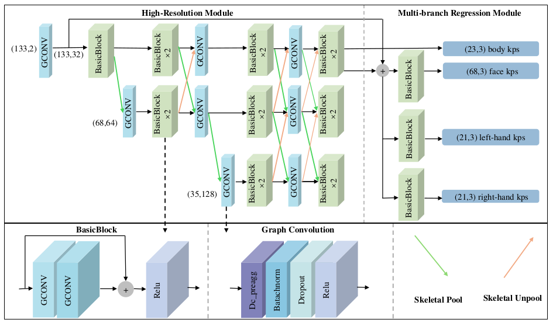

# 3D Whole-body Pose Estimation Using Graph High-Resolution Network for Humanoid Robot Teleoperation
<a href="https://hits.seeyoufarm.com"></a>
</a>
<p align="center"></p>


This repository contains the pytorch implementation of the approach described in the paper:
> Mingyu Zhang,Yuanchuan Lai ,Yang Zhang ,Qing Gao. 
[3D Whole-body Pose Estimation Using Graph High-Resolution Network for Humanoid Robot Teleoperation](https://github.com/Z-mingyu/GraphHRNet)

[comment]: <> (Proceedings of the IEEE/CVF Conference on Computer Vision and Pattern Recognition &#40;CVPR&#41;, 2021, pp. 16105-16114)


[comment]: <> (```)

[comment]: <> (@InProceedings{Xu_2021_CVPR,)

[comment]: <> (    author    = {Xu, Tianhan and Takano, Wataru},)

[comment]: <> (    title     = {Graph Stacked Hourglass Networks for 3D Human Pose Estimation},)

[comment]: <> (    booktitle = {Proceedings of the IEEE/CVF Conference on Computer Vision and Pattern Recognition &#40;CVPR&#41;},)

[comment]: <> (    month     = {June},)

[comment]: <> (    year      = {2021},)

[comment]: <> (    pages     = {16105-16114})

[comment]: <> (})

[comment]: <> (```)

## Introduction & Dataset

We train and evaluate models for 3D whole-body pose estimation on the [H3WB](https://github.com/wholebody3d/wholebody3d).

Train_data [Download Link.](https://drive.google.com/file/d/1eCV-oxneE6NTnsO3z_eR_uLaE6wByx2J/view?usp=drive_link)

Test_data [Download Link.](https://drive.google.com/file/d/1vtYZiUQu6X_aT6vx2bb0sNdGIkS7xY3A/view?usp=drive_link)

Please put the train_data and test_data in the data directory

Whole-body 2D joints of the human pose are exploited as inputs. 2D poses are scaled according to the image resolution and normalized to [-1, 1]; 3D poses are aligned with respect to the root joint and the unit of 3D pose data changed from millimeter to meter. 

Please refer to [VideoPose3D](https://github.com/facebookresearch/VideoPose3D) for the visualization code.
## Quickstart

This repository is build upon Python v3.8 and Pytorch v1.13.1 on Ubuntu 20.04 LTS. All experiments are conducted on a single NVIDIA RTX 3090 GPU. See [`requirements.txt`](requirements.txt) for other dependencies. Then you can install dependencies with the following commands.

```
git clone https://github.com/Z-mingyu/GraphHRNet.git
cd GraphHRNet
pip install -r requirements.txt
```

### Evaluation 
```
python HRNet_GCN_WB.py --gcn {gcn_name}  --evaluate checkpoint/{weight_name}.pth.tar -cfg checkpoint/w32_adam_lr1e-3.yaml
```

### Training 
```
# Decoupled Vanilla GCN (What method used in paper)
python HRNet_GCN_WB.py --gcn dc_vanilla

# Decoupled Pre-Aggresive GCN (What method used in paper)
python HRNet_GCN_WB.py --gcn dc_preagg

# Semantic GCN (What method used in paper)
python HRNet_GCN_WB.py --gcn semantic

# Decoupled Post-Aggresive GCN
python HRNet_GCN_WB.py --gcn dc_postagg

# Convolution-style GCN
python HRNet_GCN_WB.py --gcn convst

# No-sharing GCN
python HRNet_GCN_WB.py --gcn nosharing

# Modulated GCN
python HRNet_GCN_WB.py --gcn modulated
```


### Pre-trained weight
The best checkpoint has been uploaded with  hyper-parameters and configuration file

[Download Link.](https://drive.google.com/file/d/1FQpAnNyycKXgqlJ7vitFgP7KDwD365sQ/view?usp=sharing)


### Acknowledgement
This code is extended from the following repositories.
- [VideoPose3D](https://github.com/facebookresearch/VideoPose3D)
- [Semantic GCN](https://github.com/garyzhao/SemGCN)
- [Modulated-GCN](https://github.com/ZhimingZo/Modulated-GCN)
- [GraphSH](https://github.com/tamasino52/GraphSH)
- [H3WB](https://github.com/wholebody3d/wholebody3d)

Thank you to authors for releasing their code. Please also consider citing their works.
